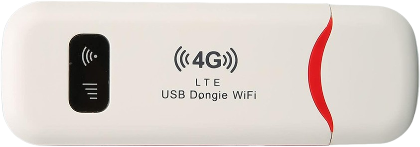

<br /> <p align="center"><a href="https://github.com/theXappy/UZ801-LTE-USB-MODEM" target="_blank"></a></p>

<p align="center"></a>
</p>

## Intro
I bought this "4G LTE USB Dongle WiFi" from AliExpress around 2023.  
After playing with it for a while, I decied to document all the quirks/tricks I've learned.  
I'm not the first one to research this thing, so some of the link below are to other GH repos by other, smarter people.  
SoC seems to be: `Qualcomm Snapdragon 410 (MSM8916)`  
USB Hardware IDs: `VID_05C6 PID_90B6`  
Modem Identifiers (fetched with AT commands):
```
ATI
Manufacturer: QUALCOMM INCORPORATED
Model: 4094
Revision: UZ801_V01R01B06  1  [Sep 07 2015 23:00:00]
SVN: 01
IMEI: +CGSN:8666800XXXXXXXX
+GCAP: +CGSM,+DS,+ES

AT^SWVER
UZ801_2.0.0

AT^HWVER
Part=206  version=1.0
```

## Table of Contents
### 🌐 Web App & ADB
1. [Blackbox Web App UI + API Research](Web_Interface.md)
2. [Whitebox Web Server via ADB exploration](Web_Server_ADB_exploration.md)
3. [Replacing the Web Server (or any APK) by abusing test-keys (Part 1)](https://www.blinkenlights.ch/ccms/posts/aliexpress-lte-1/) [[Part 2](https://www.blinkenlights.ch/ccms/posts/aliexpress-lte-2/)] (by adrian-bl)
   - Their device doesn't look the same (+ I had root on by default) but mine also deployed test-keys so the same logic applies.

### ☎️ Modem
1. [Modem drivers for Windows + AT Commands communication](Modem_AT_Commands.md)
2. [Sniffing 3G/4G Traffic via QCSuper & Wireshark](https://github.com/P1sec/QCSuper) (by P1sec).
   - Just run the `./qcsuper.py --adb --wireshark-live` afte enabling ADB (which enables DIAG as well, I think)

### 📱Screen Control
1. [Screenshots + Disabling Screen Timeout](https://github.com/u0d7i/uz801) (by u0d7i)
   - Don't use the screenshots manually, use the next link (adbcontrol) for 2-way interactions.
   - The device is running Android KitKat (4.4.4, SDK 19) so neither scrcpy nor Vysor work.
2. [View & Control Device "Display" via adbcontrol](https://github.com/AlienWolfX/UZ801-USB_MODEM?tab=readme-ov-file#view-device-display) (by AlienWolfX)
3. [Change UI Language to English](https://www.youtube.com/watch?v=8krFZxOXuiE)
   - I tried u0d7i's way and it didn't work for me. Using the Settings app via remote control did.

### 🪄 Firmware Backup/Flashing
1. [SuperSU, EDL, FW Dump/Restore, Installing OpenWRT/Debian](https://github.com/AlienWolfX/UZ801-USB_MODEM?tab=readme-ov-file#firmware-dump-and-restore) (by AlienWolfX)
2. [Another EDL Guide, Lots of hardware/software documentations](https://github.com/u0d7i/uz801) (by u0d7i)
3. [OpenStick: Install Debian and bridge LTE to WiFi/rndis](https://www.kancloud.cn/handsomehacker/openstick/2636505) [[Repo](https://github.com/OpenStick/OpenStick)] (by handsomehacker)


